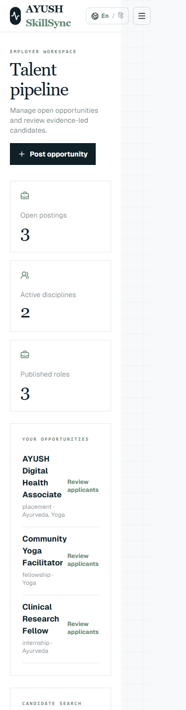

# AYUSH SkillSync

[](https://www.sih.gov.in/)
[](https://www.sih.gov.in/)
[](https://nextjs.org/)
[](https://nodejs.org/)
[](https://www.mongodb.com/)
[](https://github.com/Yash-pluto/zero-day-sih-arch)

AYUSH SkillSync is an academia-industry collaboration platform for **Smart India Hackathon 2026 Problem Statement SIH26044**. It connects AYUSH students, institutions, employers, mentors, and administrators through verified skills, structured opportunities, explainable matching, and portable skill passports.

## Product Scope

- AYUSH-specific taxonomy across Ayurveda, Yoga, Unani, Siddha, Homoeopathy, Sowa-Rigpa, and allied programmes.
- Student skill-gap dashboards based on stored proficiency and taxonomy data.
- Institution reporting for learner profiles, placement rates, and discipline coverage.
- Employer opportunity publishing, applicant review, candidate search, and application status updates.
- Explainable matching using skill fit, domain fit, eligibility, location, and availability.
- Evidence-based verification for certificates, projects, assessments, and mentor evaluations.
- QR-enabled public skill passports with verified evidence links.
- English and Hindi interface support with mobile-first layouts.
- Role-based access for student, institution, employer, mentor, and administrator accounts.

## Architecture

```text
client/  Next.js App Router, TypeScript, Tailwind CSS, Framer Motion
server/  Node.js, Express, Mongoose, JWT authentication, Multer uploads
storage/ MongoDB for users, profiles, taxonomy, opportunities, matches, and applications
```

The client communicates with the Express API through `NEXT_PUBLIC_API_URL`. Authentication uses a short-lived browser session token stored by the client. Production deployments must use HTTPS, a strong `JWT_SECRET`, restricted CORS origins, and managed MongoDB credentials.

## Demonstration

### Employer workspace



The presentation flow is:

1. Open the homepage and select a role.
2. Sign in with a seeded account.
3. Student: inspect skill gaps, explore explainable matches, apply, and open the QR passport.
4. Employer: publish an opportunity, search verified candidates, and review applicants.
5. Mentor or institution: review submitted evidence.
6. Administrator: inspect aggregate platform reporting and verification queues.

Seed data before a presentation so the flow includes real taxonomy nodes, opportunities, profiles, evidence, matches, and applications.

## Local Development

### Requirements

- Node.js 20 or newer
- npm 10 or newer
- MongoDB Atlas or a local MongoDB instance

### Installation

```bash
git clone https://github.com/Yash-pluto/zero-day-sih-arch.git
cd zero-day-sih-arch
npm install
npm install --prefix server
npm install --prefix client
```

Create the environment files from the committed templates:

```bash
cp server/.env.example server/.env
cp client/.env.example client/.env.local
```

On Windows PowerShell, use:

```powershell
Copy-Item server/.env.example server/.env
Copy-Item client/.env.example client/.env.local
```

Set `MONGODB_URI` and `JWT_SECRET` in `server/.env`, then start both services:

```bash
npm run dev
```

The default local URLs are:

- Client: `http://localhost:3000`
- API: `http://localhost:5000`
- API health: `http://localhost:5000/api/health`

Seed the presentation dataset:

```bash
cd server
npm run seed
```

The seed script is idempotent. Demo accounts and credentials are documented in [DEMO.md](DEMO.md). Do not use demo credentials in production.

## Deployment

### Backend on Render

1. Create a new Render **Web Service** from this repository.
2. Set the service root directory to `server`.
3. Set the build command to `npm install`.
4. Set the start command to `npm start`.
5. Add these environment variables in Render:

```text
NODE_ENV=production
PORT=10000
MONGODB_URI=<your MongoDB Atlas connection string>
JWT_SECRET=<long random secret, at least 32 characters>
JWT_EXPIRES_IN=7d
CLIENT_ORIGIN=https://<your-vercel-domain>
```

6. Deploy and verify `https://<your-render-domain>/api/health` returns JSON with `status: "ok"`.
7. Allow the Render deployment to access MongoDB Atlas by configuring the Atlas network access policy. Prefer a controlled production network policy over `0.0.0.0/0`.

### Frontend on Vercel

1. Import the repository into Vercel.
2. Set the project root directory to `client`.
3. Use the default Next.js build settings.
4. Add these environment variables:

```text
NEXT_PUBLIC_API_URL=https://<your-render-domain>/api
NEXT_PUBLIC_SITE_URL=https://<your-vercel-domain>
```

5. Redeploy after setting the variables.
6. Replace `CLIENT_ORIGIN` in Render with the final Vercel URL, then redeploy the API.

Do not commit `.env`, `.env.local`, database credentials, JWT secrets, or uploaded evidence. The repository ignores these files; rotate any credential that has previously been exposed.

## Validation

```bash
npm test
npm run build --prefix client
node --check server/src/app.js
```

The client production build verifies TypeScript, linting, route generation, and static page generation. The server suite verifies health and unknown-route behavior, while matching tests cover the five-factor weighted score model.

## Repository Layout

```text
client/                 Next.js application
client/app/             App Router pages and route layouts
client/components/      Shared navigation, auth, charts, and UI components
client/messages/        English and Hindi dictionaries
server/src/routes/      Express route definitions
server/src/controllers/ API request handlers
server/src/models/      Mongoose models
server/src/services/    Matching and domain services
server/tests/           API and service tests
```

## Team Zero Day

**Anurag** — Team Lead, Technical and Prototype
[Portfolio](https://anurag-pixel.vercel.app) · [GitHub](https://github.com/anuragg-pixel) · [LinkedIn](https://linkedin.com/in/anurag-pixel)

**Nausheen** — Technical and Prototype
[GitHub](https://github.com/nausheenfirdous) · [LinkedIn](https://www.linkedin.com/in/nausheen-firdous-75844a387/)

**Yash Vardhan** — Technical and Prototype
[Portfolio](https://yash-pluto.vercel.app) · [GitHub](https://github.com/yash-pluto) · [LinkedIn](https://linkedin.com/in/vardhan-yash3105)

**Shreas** — Technical and Presentation
[GitHub](https://github.com/shreas-shivam) · [LinkedIn](https://www.linkedin.com/in/shreas-shivam-4b724b38a/)

**Nikhil** — Technical and Presentation
[GitHub](https://github.com/Nikhil-phoenix) · [LinkedIn](https://www.linkedin.com/in/nikhil-verma-aa9784393/)

**Shraddha** — Technical and Presentation
[GitHub](https://github.com/Shraddha-Rawat) · [LinkedIn](https://www.linkedin.com/in/shraddha-kumari-5392b3384/)
